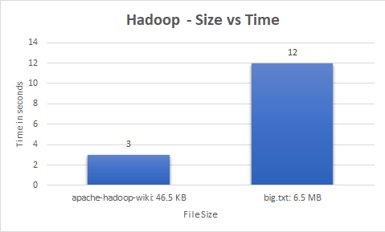

# Hadoop MapReduce Word Count Data Analysis

<p align="center">
    <a href="#">
      
    </a>
</p>
 
## Description

Data Analysis and comparison of execution times of a MapReduce program to compute the word counts of sample input text files of different sizes executed on Hadoop. Mapper and Reducer class are written in Java and run on the local cluster mode in Hadoop.

## Environment

- Hadoop local mode
- JDK 8

## File Sizes

- apache-hadoop-wiki.txt: 46.5 kB
- big.txt: 6.5 MB 

## Execution

1. Start hdfs and yarn daemons

   ```
   start-hdfs.sh
   start-yarn.sh
   ```

2. Open a java project in Eclipse

3. In the java project, Add External Archives using a build path
   From the hadoop software folder add :

   ```
   /common/*.jar 
   /common/lib/All
   /hdfs/*.jar
   /mapreduce/*.jar
   /yarn/*.jar
   ```

4. Write the mapper, reducer and driver class

5. Export it into a .jar file 

6. Make a sample input file (Source: text, data set)

7. Copy file from local to hdfs
   
   ```
   hdfs dfs -copyFromLocal <sourcefile> <destinationPath>
   ```

8. Submit the file to the hdfs cluster
   
   ```
   Hadoop jar <source.jar Path> MainClassDriver <sourceFile Path in hdfs> <Destination Folder path in hdfs>
   ```

9. Read the output file

   ```
   hdfs dfs -cat /DestinationFolder/* to view the results
   ```

10. Stop all the hdfs daemons
	
   ```
   stop-dfs.sh
   stop-yarn.sh
   ```
   
## Observations

<br>
<p align="center">
	
</p>

The average execution times for the word count programs on hadoop are:

- apache-hadoop-wiki.txt: 3 seconds
- big.txt: 12 secs   
   
## Source Code
- [WordCountDriver](src/WordCountDriver.java)
- [WordCountMapper](src/WordCountMapper.java)
- [WordCountReducer](src/WordCountReducer.java)
   
## File Sources

- [apache-hadoop-wiki](https://en.wikipedia.org/wiki/Apache_Hadoop)
- [big](https://norvig.com/big.txt)
