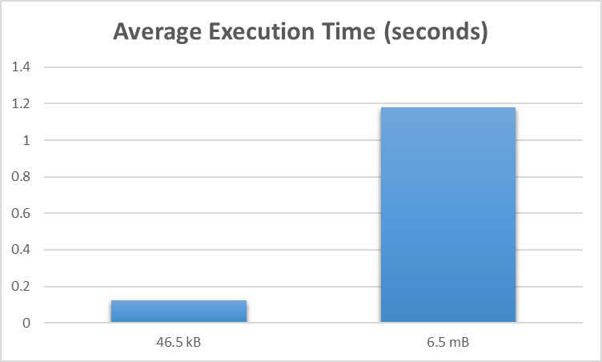

# Java Word Count Data Analysis

	

## Overview

Data Analysis & comparisons on execution times taken while computing word counts for sample input text files of different sizes written in core Java.

## Environment

- Eclipse JEE/ IntelliJ
- JDK 8

## File Sizes

- apache-hadoop-wiki.txt: 46.5 kB
- big.txt: 6.5 MB 

## Execution Steps

1. Import the project into respective IDE.
2. Switch to Java Perspective.
3. Add Java JDK path/library
4. Build Project
5. Run as Java Application to execute and view results.

## Observations 
 

	

The average execution times for the word count programs in Java are:

- apache-hadoop-wiki.txt: 0.123 seconds
- big.txt: 1.179 seconds

## Source Code
To view the word count programs for 
- [Apache-hadoop-wiki](WordCount_java/src/ApacheWordCount.java)
- [big](WordCount_java/src/BigWordCount.java)

## Word Count Results

To view the results of the word counts
- [apache-hadoop-wiki](WordCount_java/Result/Word-count-apache-hadoop-wiki.txt)
- [big](WordCount_java/Result/big.txt)

## File Sources

- [apache-hadoop-wiki](https://en.wikipedia.org/wiki/Apache_Hadoop)
- [big](https://norvig.com/big.txt)
