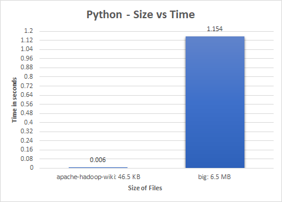

# Python Word Count Data Analysis

<p align="center">
	<a href="#">
		
	</a>
</p>

## Overview

We calculate the execution time taken by Python to find the word counts of a small file (45.6 KB) and an extremely big file (6.5 MB) and compare our findings. To do this, we first read the respective files, calculate word counts and then write the results to the file. The execution time is calculated from the reading the file to when the results have been written.

## Environment

- Python 
- windows

## File Sizes

- apache-hadoop-wiki.txt: 46.5 KB
- big.txt: 6.5 MB 

## Execution Steps

1. Import this project.
2. Navigate to the path with the python code.
3. Execute the program in cmd using:
```
python.exe smallWordCount.py
python.exe bigWordCount.py
```

## Results
 
<br>
<p align="center">
	
</p>

The average execution times in Python were found to be:

- apache-hadoop-wiki.txt: 0.006 seconds (rounded off)
- big.txt:  1.154 seconds (rounded off)

## Source Code
To view the word count programs for 
- [Apache-hadoop-wiki](smallWordCount.py)
- [big](bigWordCount.py)

## Word Count Results

To view the results of the word counts
- [apache-hadoop-wiki](small-result-python.txt)
- [big](big-result-python.txt)

## File Sources

- [apache-hadoop-wiki](https://en.wikipedia.org/wiki/Apache_Hadoop)
- [big.txt](https://norvig.com/big.txt)