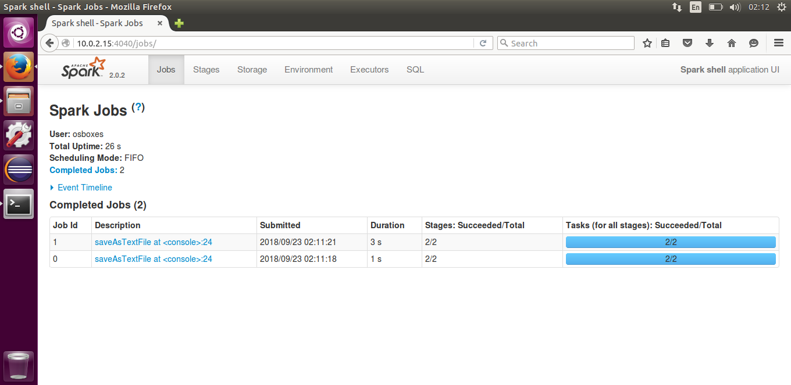

[](https://opensource.org/licenses/Apache-2.0)

# Description

To find the word count and compare the execution time for different sizes of input textFiles executed in Spark-Shell written in Scala using RDDs

## Run Command:

In terminal execute

```
spark-shell -i "SparkWordCount.scala"
```

## File Sources

- [apache-hadoop-wiki](https://en.wikipedia.org/wiki/Apache_Hadoop)
- [big.txt](https://norvig.com/big.txt)


## File Sizes

- apache-hadoop-wiki.txt: 46.5 kB
- big.txt: 6.5 MB 

## Execution time 
<p align=center>
  
</p>

The execution time for the spark jobs on a Spark local mode :

- apache-hadoop-wiki.txt: 1s
- big.txt: 3s
