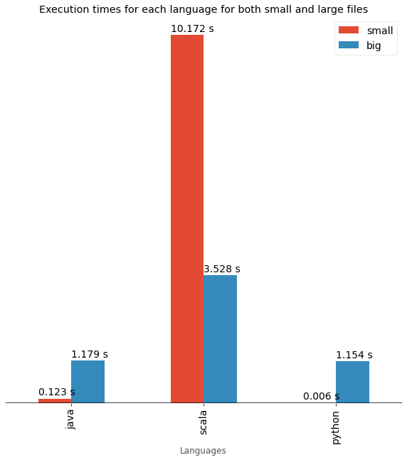

## Aim
To find out which of the programming languages and execution engines take the maximum and the minimum amount of time to process files.

## Methodology

This :green_book: project conducts data analysis :bar_chart: & comparisons of the execution times :watch: taken for computing the word count of input text files varying from extremely small to extremely large sizes in various programming languages and execution engines. This project includes sample findings, observations, comparisons and sample word count programs. We then calculate the time taken to process the files individually and gather the results. All of the findings from individual analyses were collected and combined in a google colab notebook where we have plotted graphs using matplotlib and drawn conclusions based on our findings.

## File Sizes

| File Name              | Size    |
|------------------------|---------|
| apache-hadoop-wiki.txt | 46.5 kB |
| big.txt                | 6.5 MB  |

## File Sources

- [apache-hadoop-wiki](https://en.wikipedia.org/wiki/Apache_Hadoop)
- [big.txt](https://norvig.com/big.txt)

## Programming Languages

Computing for individual languages. Click the images to go to the respective data analysis results.

 

	
		
		

## Execution engines

Computing for individual execution engines. Click the images to go to the respective data analysis results.

 

	
	
	

## Visualizing Results

### Comparing Programming Languages

	

	

### Comparing Execution Engines	
	

		

## Conclusions

We have observed from the graphs that **Python** has the least execution time for small and large files while **Scala** has the largest execution time.

We have observed that **Spark** has the least execution time while **Hadoop** has the highest execution time.

## Notebook

The Google Colab Notebook with the complete Analysis with Graphs: [Notebook](Data-Analysis.ipynb) 
