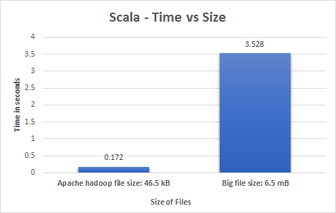

	

# Scala Word Count Data Analysis

We calculate the execution time taken by Scala to find the word counts of a small file (45.6 KB) and an extremely big file (6.5 MB) and compare our findings. To do this, we first read the respective files, calculate word counts and then write the results to the file. The execution time is calculated from the reading the file to when the results have been written.

## Environment

- Eclipse JEE/ Scala eclipse IDE/ IntelliJ
- JDK 8
- Scala version 2.12.0

## File Sizes

- apache-hadoop-wiki.txt: 46.5 kB
- big.txt: 6.5 MB 

## Execution Steps

1. Import the project into respective IDE.
2. Switch to Scala Perspective.
3. Add Scala Nature
4. Set Compiler version to 2.12.0
5. Build Project
6. Run as Scala Application to execute and view results.

## Results
 
 

	

The average execution times in Scala were found to be:

- apache-hadoop-wiki.txt: 0.172 seconds
- big.txt:  3.528 seconds

## File Sources

- [apache-hadoop-wiki](https://en.wikipedia.org/wiki/Apache_Hadoop)
- [big.txt](https://norvig.com/big.txt)