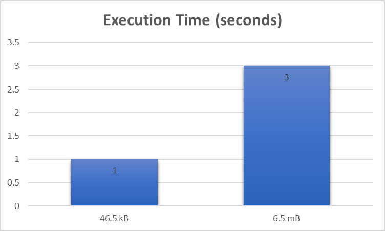

[](https://opensource.org/licenses/Apache-2.0)

# Description

Data Analysis & comparisons of the execution time take to compute word counts for different input textFile sizes executed on Spark-Shell in Scala on the local cluster mode.

## File Sizes

- apache-hadoop-wiki.txt: 46.5 kB
- big.txt: 6.5 MB 

## File Sources

- [apache-hadoop-wiki](https://en.wikipedia.org/wiki/Apache_Hadoop)
- [big.txt](https://norvig.com/big.txt)

## Prerequisties

- Linux system
- Spark set up in Local cluster mode

## Execution

In terminal execute the following command:

```
spark-shell -i "SparkWordCount.scala"
```

## Observations 
<br>
<p align="center">
	
</p>

The average execution times for the spark jobs on Spark local mode are:

- apache-hadoop-wiki.txt: 1s
- big.txt: 3s